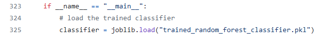
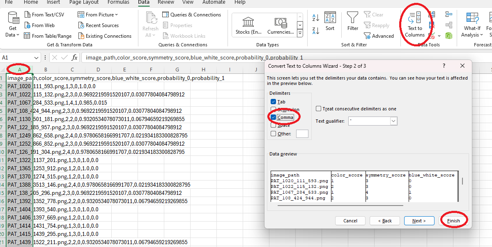
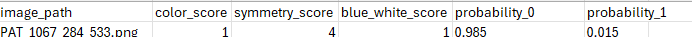

# Welcome to GroupIT repository :)

## 3_in_1_code_with_trained_classifier.py:
description how to use the code and how to interprete the scores:

### INPUT:  

    - images folder path
    - masks foler path
    - path for the output file .csv with results of all 3 features and the probability of a lesion to be a melanoma

Be sure that the code 3_in_1_code_with_trained_classifier.py and trained_random_forest_classifier.pkl are located on the same directory level. By deafult both of these files are on the main page of the repository, as no specific paths are provided within the code for the classifier file:

#### example of inputs:  
     - image_folder = " C:/Users/cieci/OneDrive/Dokumenty/GitHub/GroupIT-working-on-project/data/images_orginal"  
     - mask_folder = " C:/Users/cieci/OneDrive/Dokumenty/GitHub/GroupIT-working-on-project/data/masks_orginal"  
     - output_csv = " C:/Users/cieci/OneDrive/Dokumenty/GitHub/GroupIT-working-on-project/results.csv"  

Please input the paths with " / " not " \ "   

### OUTPUT:

    - .csv with results of all 3 features and the probability of a lesion to be a melanoma  
    
You might need to change the separation in your .csv file so that the results will be easier to read:

1. select the data clicking on column A
2. go to "data" settings
3. go to text to colums
4. change the seperation to comma
   

   
#### Output understanding:

##### image_path 

##### color_score   

                1 - relatively dull or monochromatic  
                2 - some color variation, but it may lack intensity or diversity   
                3 - significant color variation with vibrant and diverse hues   
                4 - intense and varied colors, resembling a rainbow   
                 
##### symmetry_score 

                 1 - none symmetry      
                 2 - low symmetry        
                 3 - moderate symmetry       
                 4 - perfect symmetry 
                 
##### blue_white_score 

                 0 - blue-white veil not detected,
                 1 - blue-white veil detected 
  
##### probability_0 

                [0;1] probability that the lesion belongs to class 0 (non melanoma) 
    
##### probability_1  

                [0;1] probability that the lesion belongs to class 1 (melanoma)  
  
###### Example:

if probability_0 is 0.985 and probability_1 is 0.015 for a particular image-mask pair, it means that the classifier is 98,5% confident that the pair belongs to class 0 (not melanoma) and 1,5% confident that it belongs to class 1 (melanoma).
    
    
        
The classifier is: "trained_random_forest_classifier.pkl" on the main page of the repository.

  
    
  

 #### trained_random_forest_classifier.pkl  - trained classifier 
 #### final_report_groupit.pdf 
 #### img folder (images used in README)
 
 ## All additional files used while working on project:
https://github.com/aniela2906/GroupIT-working-on-project.git
